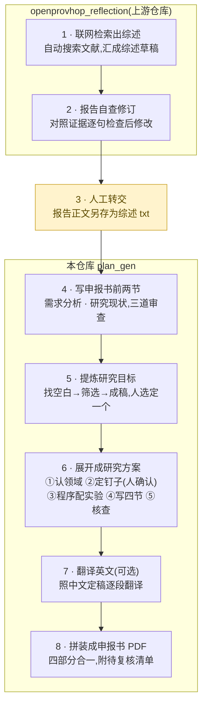

# 研究方案生成器(plan_gen)

[English README](README_EN.md)

## 这是什么
**喂一份「研究现状 / 文献综述」文本 → 自动产出一份完整的申报书草案**(需求分析、
研究现状、研究目标、研究方案四大节,拼成 PDF,可附英文版),并给出从综述原文到
每个数字的完整溯源。

```
综述 txt → overview_gen(前两节) → goal_gen(研究目标,人选定一个)
        → design_gen(研究方案四节) → [translate_en 可选英文] → make_plans(出 PDF)
```

每个生成环节都是同一个质量套路:**AI 起草 → AI 自查修改 → 程序核对 → 人来把关**。
所有成稿末尾都带【人工复核清单】——机器把拿不准的列出来,逐条处理完删掉才算交稿。

上游两步(联网检索与反思修订)由姊妹仓库
**[openprovhop_reflection](https://github.com/Andychen517/openprovhop_reflection)**
完成——本管线吃它产出的综述报告。全链白话流程图:



---

## 一、快速开始

### 1. 装依赖
```
pip install openai python-dotenv reportlab
```

### 2. 配 API key
把 `.env.example` 复制成 `.env.local`(放在本文件夹或仓库根),填入 OpenRouter key:
```
OPENAI_KEY=你的_openrouter_key      # https://openrouter.ai/keys 免费领
OPENAI_ENDPOINT=https://openrouter.ai/api/v1
CUSTOM_MODEL=deepseek/deepseek-r1-0528
```

> **国内需给「终端」开代理**(不是浏览器,是运行命令的窗口),否则报 APIConnectionError:
> `$env:HTTPS_PROXY="http://127.0.0.1:端口"`,同窗口再跑。deepseek-r1 偏慢,
> 单步几十秒到几分钟正常,脚本会自动重试断连。

### 3. 完整流程(命令逐条粘贴!脚本中途会用 input() 问你,整块粘贴会把后面的命令当成回答吃掉)
```
python overview\overview_gen.py 综述.txt "一句话研究需求"
python goal_gen.py 综述.txt "一句话研究需求"
       ↑ 结尾会列出 2~3 个研究目标让你输编号选定一个(必做,design 只对选定目标展开)
python design\design_gen.py
       ↑ 有两处会停下来等你确认(黄灯),见下文 design 详解
python make_plans.py
       ↑ 会问"需要附英文版吗?" y=现场翻译并多出英文 PDF,回车=只出中文
```
产出:`traceability_and_result\plan_final.pdf`(及可选 `plan_final_en.pdf`)。

可选的溯源报告(把生成链摊开给人检查):
```
python make_report.py 综述.txt              → goal_traceability.pdf
python overview\make_overview_report.py     → overview_traceability.pdf
```

### 目录结构
```
plan_gen\
├─ goal_gen.py / make_plans.py / make_report.py / translate_en.py   管线脚本
├─ overview\    前两节生成(overview_gen.py + 溯源脚本)
├─ design\      研究方案生成(design_gen.py + 架构一页纸.md)
├─ tests\       四个负对照测试 + 通用测试综述 + 测试说明
├─ cases\       完整案例归档(education 教育全链路 / deicing 除冰全链路)
├─ papers\      源文献 PDF(有版权,勿外发)
├─ output\      当前活跃课题的全部中间产物与成稿
└─ traceability_and_result\   溯源报告与方案 PDF
```

---

## 二、各部分功能详解

### goal_gen.py —— 研究目标(七步 + 人工选定)
1. **A 结构化拆解**:把综述按方法拆成"单元卡"(方法/国内外/数据/定量指标/局限)。
   带缓存指纹,同一份综述只抽一次,overview 与 goal 两条线共用同一套证据。
2. **B 对比抽空白**:把所有卡摆在一起横向对照,找"卡与卡之间"的研究空白
   (5 类;宁缺毋滥,每条必须挂上涉及的卡并说清张力)。
3. **去重**:AI 判断哪些空白是同一件事的不同说法,程序取证据并集、重新编号。
4. **C 转候选**:每条空白翻转成候选目标(目标句+关键问题+定量增量+证据指针)。
   铁律:现状数字必须注明出自哪张卡,目标数字必须标"拟定/预期"。
5. **反思**:逐条按 4 项打分(无幻觉且数字语义正确/具体可证伪/对齐/证据对应),
   判 通过/标记(带⚠继续走)/淘汰。专治"数字是真的、含义被偷换"这类隐蔽幻觉。
6. **D 扩写**:候选各自扩写成一段申报书正文,内部编号(U1 等)全部翻译成方法名称。
7. **锦标赛**:对完整正文按 依据强度/研究价值/可行性 打分排名(只排名,不改稿)。
8. **人工选定**:终端列出全部目标与排名,你输编号选一个 → `selected_goal.json`。
   机器负责摆桌,选方向永远是人的决定。

### overview\overview_gen.py —— 申报书前两节
从综述产出 **(一)需求分析 + (二)研究现状**。需求分析走四段式(现实需求→障碍
主线→场景→研究问题);研究现状把综述原文按应用主题重新组织。内置**三镜头
评审循环**(一致性:骨架五要素对齐 / 忠实性:对照原料查数字语义与归属 /
表达:数字密度与措辞),评审→修订最多两轮,另有正则预检和数字溯源检查。

### design\design_gen.py —— 研究方案四节(白话版详解)
**运行条件(重要)**:必须先在 goal_gen.py(结尾选编号)或 make_plans.py
(补选窗口)里选定了唯一一个研究目标(`output\selected_goal.json` 存在)。
没选定直接退出,不猜。

**团队/设备/数据(可选)**:传一个 txt 进来就写进"(四)可行性"的条件层;
不传就留空标"待补充",绝不编造团队信息。用法:
```
python design\design_gen.py             # 条件可行留空标待补充
python design\design_gen.py team.txt    # 额外喂团队/设备/数据材料
```
它内部一共七步,其中两步会**停下来等你**:

**第 0 步·读入分池**:只认选定目标"点过名"的那几张证据卡——研究对象、数据、
基线只能从这几张卡里来,其余卡只能在技术比较时当陪衬。防止方案偷用无关数据。

**第 1 步·先认清课题属于哪一行(领域画像,停下等你 ①)**:AI 先判断这个课题
是哪个领域的(教育 AI?电力工程?),然后现场推导这一行的"行话"该怎么说、
成果惯用什么方式验证(数据集实验?仿真?试验台架?)。推完打印给你看一眼,
认错行当场纠正。为什么需要这步:不认行,写教育课题会串进电力词汇,反之亦然。

**第 2 步·定死三件事 + 给维度分类(停下等你 ②)**:
- 定死三件事(俗称"钉子"):研究什么任务、拿哪个模型/装置当实验对象、
  用什么数据。不定死,AI 写长文会"漂"——写到后面自己换数据换模型,
  实验就没法比了。主数据只准从证据卡里真实用过的数据中选,严禁编造。
- 给每个技术维度问三个问题:它能"装上/拆掉"做对照吗?→是**干预**
  (比如给模型加量化);它只是对象自带的属性、只能选不同取值吗?→是
  **条件因素**(比如材料是钢还是复合材料);它只是"怎么测"吗?→是
  **测量方法**。三个都不是就老实标"待人工"。
- 这一步终端会把分类依据逐条打出来。**重点看**:如果你的课题明明有要施加的
  技术手段,屏幕却显示"0 个干预",说明 AI 提维度时漂了,输 c 逐条改。

**第 3 步·程序自动配实验方案(不用 AI)**:拿上一步的分类查一张写死的表——
全是"干预"→ 一套开关对照实验(比如 3 个干预就是 2^3=8 组全组合);
有"条件因素"→ 分阶段试验(先对照、再多水平、含交互);目标里有长期性要求
→ 追加寿命循环试验。为什么不用 AI:分类定了之后这就是查表,查表要的是
稳定和可追责,不是创造力。

**第 4 步·分解出底稿**:把基线指标(只列名字不填数——数值是立项后实验测的)、
每个技术维度的备选方案对照(优点缺点都必须写)、机制之间可能怎么互相影响、
实验配置表,全部整理成结构化底稿。

**第 5 步·写成四节文字**:各节各管一摊,写串了算缺陷——
| 节 | 只回答 | 白话 |
|---|---|---|
| (一)研究内容 | 研究什么 | 要做哪几块事 |
| (二)思路方法 | 怎么做 | 实验操作说明书:怎么分组、测什么、怎么分析 |
| (三)比较优势 | 凭什么选它 | 技术选型说明书:候选有哪些、为何选这个;只写机制本身的特点,不许写"能提升多少"这种要实验才知道的话 |
| (四)可行性 | 凭什么做得成 | 理论有基础、工具是现成的、条件够不够 |

**第 6 步·AI 评审 + 修订**:另一个 AI 按 11 条标准挑毛病(数字有没有来路、
别人论文的数字有没有被冒充成自己的基线、实验组数对不对、四节有没有越界……),
点名的地方修一轮,最多两轮。

**第 7 步·程序安检 + 复核清单**:四道正则检查(内部编号泄漏/数字来路/
文献数字冒充基线/声称要研究的交互必须有实验能测它),全部拿不准的写进
文末【人工复核清单】。产出 `output\design.txt`。

### translate_en.py —— 英文版(可选)
中文成稿定稿后逐节忠实翻译成英文(翻译而非重新生成,中英内容严格一一对应),
存 `plan_en.json`。复核清单不翻译——中文版永远是权威版本。
一般不用手动跑:make_plans 问你要英文时会自动调它。

### make_plans.py —— 拼装出 PDF(纯程序,不调 AI)
读前两节+选定目标+方案四节,拼成完整申报书 PDF(四大节+锦标赛信息+
复核清单附录)。交互时问一句"需要附英文版吗?"——全链唯一的语言开关。
未选定目标时会出 plan1~N 并提供补选窗口。

### make_report.py / overview\make_overview_report.py —— 溯源报告(纯程序)
把生成链摊开成 HTML/PDF:原文→单元→空白→候选→反思→成稿→排名,
每个数字从哪来一目了然。给人工复核和汇报用。

---

## 三、产出(都在 output\ 文件夹)
| 文件 | 是什么 |
|---|---|
| units.json | A 抽的方法单元卡(两条线共用,一份综述只抽一次) |
| units_fingerprint.txt | A 步缓存指纹(综述/开关一变自动重抽) |
| gaps.json / gaps_merged.json | B 抽的空白 / 去重合并后的空白 |
| candidates.json | C 的候选目标(结构化底稿) |
| reflections.json | 反思的逐条打分与判定 |
| research_goal.txt | **研究目标成稿** |
| tournament.json / selected_goal.json | 锦标赛排名 / 人工选定结果 |
| overview.txt / overview_meta.json / overview_review_r*.json | 前两节成稿与评审记录 |
| design_domain.json | 领域画像(这一行怎么说话、怎么验证) |
| design_pins.json | 三颗钉子 + 维度分类 + 实验骨架 |
| design_items.json | 方案结构化底稿(基线指标/备选对照/实验配置) |
| design_review.json | 方案评审记录 |
| design.txt | **研究方案成稿** |
| plan_en.json | 英文翻译(translate_en 产出) |
| ../traceability_and_result/plan_final.pdf (+_en) | **最终申报书 PDF(双语)** |
| ../traceability_and_result/*_traceability.* | 两份溯源报告 |

---

## 四、现成的测试综述
- `tests\test_review_imputation.txt` —— 时序缺失值插补综述(中立、多空白,多目标)
- `cases\deicing\test_review_deicing.txt` —— 电磁脉冲除冰综述(有数字,能出真定量增量)
- `tests\test_review_ml.txt` —— 机器学习预测儿童词汇(单目标复现)
- `tests\test_review.txt` —— 教育惩戒(纯定性,测防幻觉)

完整案例归档在 `cases\`:`cases\education\`(教育全链路:源报告/源文献/design
版本史/结果 PDF/答辩走查文集),`cases\deicing\`(除冰全链路归档)。

---

## 五、负对照测试(验证每道质量闸真管用,不是摆设)
```
python tests\test_reflect.py           # 造带缺陷的候选,看反思抓不抓得到硬伤
python tests\test_dedup.py             # 造两条重复的空白,看去重合不合并、证据并集对不对
python tests\test_tourney.py           # 造一强一弱,看排序把强的排前、弱的垫底
python tests\test_overview_reflect.py  # 埋 9 类缺陷的坏稿,看三镜头抓多少、好稿误杀几条
```
看终端最后的"对分表",✓ 越多说明该环节越可靠。
测试产物写在 `output\test_run\`,不会覆盖正式成稿。

---

## 六、关键参数(在 goal_gen.py 顶部)
- `N_GOALS = 3` —— 目标数上限。
- `WITH_ORIGIN = True` —— A 是否抽"国内外"。
- `WITH_QUANT = True` —— 是否做整套定量增量;纯定性综述设 False。
- 语言:全链固定中文出稿,英文永远是成稿的翻译(make_plans 里问一次)。
- `call_llm` 自动重试 + 300s 超时,治 OpenRouter 偶发断连。

---

## 七、设计要点(为什么这么做)
- **发散靠生成、收敛靠淘汰**:找空白高温放飞,后面靠去重+反思+锦标赛三道低温闸收。
- **真数字讲出处,拟数字讲身份**:现状值必须能指认出自哪张卡,目标值必须标"拟定"。
- **人只把守决策点**:选目标、认领域、定钉子——机器把材料和警示摆上桌,人签字。
- **结构决定交给程序**:实验方案的"形"由查表推出,可测试、可归因、不受示例干扰。
- **每个新环节先负对照封板再上岗**:证明它"能抓问题",而不是"看着像对"。
- **复核清单是交付的一部分**:机器不裁决,把拿不准的摊在桌上,终审在人。

---

## 八、已知局限 / 待办
- AI 评审有随机性:同一问题时抓时漏,靠程序检查和复核清单兜底,交稿前人工过一眼。
- 钉子偶尔被材料里显眼的指标"带偏"(如基准模型漂移),黄灯确认是唯一可靠拦截点——
  正式出稿务必交互跑,别全自动。
- 定量目标是模型拟定值,最终要你和导师认领。
- 目前是"复现综述里已识别/暗示的空白",还不会发明综述里没线索的新方向。
- 缺"空白复现率"正式指标与多篇综述的规模化验证。
- 未来工作:智能体调度层接入方案见 [docs/智能体接入方案.txt](docs/智能体接入方案.txt)。
