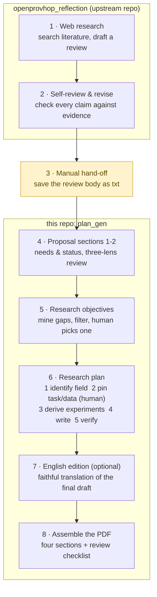

# plan_gen — Research Proposal Generator

[中文版 README](README.md)

## What it does
**Feed it a literature review (plain text) → get a complete research-proposal
draft**: needs analysis, research status, research objective, and a full research
plan — assembled into a PDF, with an optional English edition — plus complete
traceability from every number in the draft back to the source review.

```
review.txt → overview_gen (sections 1–2) → goal_gen (objectives; you pick one)
          → design_gen (research plan)   → [translate_en, optional]
          → make_plans (final PDF)
```

Every generation stage follows the same quality pattern:
**AI drafts → AI self-reviews and revises → deterministic code checks →
human sign-off**. Every output ends with a *manual review checklist* — the
machine lists everything it is unsure about; you resolve the items and delete
the block before the document counts as deliverable.

> **Language note:** the pipeline drafts everything in **Chinese** (it targets
> Chinese grant-proposal conventions). Input reviews may be in English or
> Chinese. The optional translation station produces a faithful **English
> edition of the final plan** (`plan_final_en.pdf`); the Chinese version and
> its review checklist remain authoritative.

The first two stages (web retrieval and the reflection+revision pass) live in
the sister repository
**[openprovhop_reflection](https://github.com/Andychen517/openprovhop_reflection)**
— this pipeline consumes the review it produces. Plain-language map of the
whole chain:



---

## Quick start

### 1. Install
```
pip install openai python-dotenv reportlab
```

### 2. Configure
Copy `.env.example` to `.env.local` (this folder or the repo root):
```
OPENAI_KEY=your_openrouter_key      # free at https://openrouter.ai/keys
OPENAI_ENDPOINT=https://openrouter.ai/api/v1
CUSTOM_MODEL=deepseek/deepseek-r1-0528
```
The default model (deepseek-r1) is slow; each stage takes seconds to minutes.
Transient connection errors are retried automatically.

### 3. Run the full chain (paste commands ONE AT A TIME — scripts pause for
`input()`, and a bulk paste will feed your next command into the prompt)
```
python overview\overview_gen.py review.txt "one-line research direction"
python goal_gen.py review.txt "one-line research direction"
       ↑ ends by listing 2–3 objectives; type a number to select ONE (required)
python design\design_gen.py
       ↑ pauses twice for your confirmation ("yellow lights", see below)
python make_plans.py
       ↑ asks "attach an English edition?" — y = translate now, Enter = Chinese only
```
Output: `traceability_and_result\plan_final.pdf` (+ `plan_final_en.pdf`).

Optional provenance reports:
```
python make_report.py review.txt              → goal_traceability.pdf
python overview\make_overview_report.py       → overview_traceability.pdf
```

### Directory layout
```
plan_gen\
├─ goal_gen.py + prompts_goal.py / make_plans.py / make_report.py / translate_en.py
├─ overview\    sections 1–2 generator (+ prompts_overview.py)
├─ design\      research-plan generator (+ prompts_design.py + architecture doc)
├─ tests\       negative-control tests + sample reviews
├─ docs\        future-work documents (agent-integration roadmap)
├─ output\      all intermediate artifacts of the active topic
└─ traceability_and_result\   reports and final PDFs
```

---

> **Code convention: logic, prompts and parameters are separated.** Every
> generation station keeps all its prompt templates in a sibling
> `prompts_*.py` (pure string constants, zero logic), and every tunable knob
> (feature switches, temperatures, round limits) lives in `config.py` — read
> the main script to understand the flow, touch only the prompts file to
> change generation rules, only config.py to tune behavior. One exception:
> a few goal_gen templates are assembled conditionally on feature switches
> and stay inside `goal_gen.py` (commented there).

## What each part does

### goal_gen.py — research objectives (7 steps + human selection)
1. **A · Structured extraction**: split the review into "method unit cards"
   (method / origin / data / quantitative metrics / limitations). Cached by a
   content fingerprint; one review is extracted once and shared by both lines.
2. **B · Gap mining**: lay all cards side by side and mine research gaps that
   live *between* cards (5 gap types; fewer-but-real over padding; every gap
   must cite its evidence cards).
3. **Dedup**: the LLM groups gaps that restate the same underlying gap; code
   merges evidence sets and renumbers.
4. **C · Candidate objectives**: each gap becomes a candidate (objective, key
   problems, quantitative delta, evidence pointers). Iron rule: every
   status-quo number must name its source card; every target number must be
   labelled *tentative*.
5. **Reflection**: score each candidate on 4 criteria (no hallucination &
   correct number semantics / falsifiable specificity / alignment / evidence
   relevance) → pass / flag (⚠ continues, pending human review) / eliminate.
   Built to catch the sneakiest LLM failure: *true number, stolen meaning*.
6. **D · Prose expansion**: candidates become independent proposal-grade
   paragraphs; internal card IDs are translated into method names.
7. **Tournament**: rank the finished texts on evidence strength / value /
   feasibility (ranking only, never rewrites).
8. **Human selection**: you pick one objective → `selected_goal.json`.
   The machine sets the table; choosing the direction is always yours.

### overview\overview_gen.py — proposal sections 1–2
Generates *Needs Analysis* (real-world needs → obstacle themes → target
scenario → research questions) and *Research Status* (the review reorganized
by application theme). Guarded by a **three-lens review loop** (consistency:
skeleton alignment; fidelity: number semantics & attribution against sources;
style: number density & wording), plus regex prechecks and number-provenance
checks. At most two review-revise rounds.

### design\design_gen.py — the research plan (plain-language tour)
**Prerequisite (important):** exactly one objective must have been selected —
either at the end of goal_gen.py (type its number) or via make_plans.py's
late-selection prompt — so that `output\selected_goal.json` exists. Without it
the script exits rather than guessing.

**Team / equipment / data (optional):** pass a txt file and its content goes
into the *conditions* layer of Section 4 (Feasibility); omit it and that layer
is left as "to be supplemented" — team information is never fabricated.
```
python design\design_gen.py              # feasibility conditions left as TBD
python design\design_gen.py team.txt     # feed team/equipment/data material
```
Seven internal steps; two of them **stop and wait for you**:

**Step 0 · Evidence pooling** — only the cards *cited by the selected
objective* may supply research subjects, data, and baselines; all other cards
are comparison-only. Stops the plan from quietly borrowing unrelated data.

**Step 1 · Domain profile (yellow light #1)** — the AI first works out *what
field this topic belongs to*, then derives on the spot how that field talks
and how it validates results (dataset experiments? simulation? test rigs?).
Printed for your one-glance confirmation; correct it on the spot if it guessed
the wrong field. Why: without this, an education topic drifts into power-grid
vocabulary and vice versa.

**Step 2 · Pins & dimension classification (yellow light #2)** —
- *Pins*: lock down three things — the task, the base model/apparatus, and
  the primary data. Unpinned, an LLM writing long-form drifts: later sections
  quietly swap datasets and models, and comparisons collapse. Primary data
  may only come from data actually used by the cited cards; inventing dataset
  names is forbidden.
- *Three-question classification* for every technical dimension: can it be
  switched on/off on the same carrier for a controlled comparison? → an
  **intervention**. Is it a property of the object/environment you can only
  select values of? → a **condition factor**. Does it only change *how you
  measure*? → a **protocol**. None of the above → "needs human", no forced
  labels.
- Watch the terminal: if your topic clearly applies some technique but the
  screen says "0 interventions", the dimension extraction drifted — press `c`
  and fix the labels line by line.

**Step 3 · Deterministic experiment-shape derivation (no AI)** — a hard-coded
lookup table maps the classification to an experiment structure: all
interventions → a full-factorial on/off design (3 interventions = 2³ = 8
runs); condition factors present → staged trials (controlled comparison →
multi-level factors with interactions); longevity requirements → an added
life-cycle test. Once classification is fixed this is table lookup, and table
lookup wants determinism and accountability, not creativity.

**Step 4 · Structured skeleton** — baseline metrics (names only, values come
from post-award experiments), per-dimension alternatives with pros *and* cons
both mandatory, hypothesized mechanism interactions, and the run matrix.

**Step 5 · Four sections, strict division of labor** — crossing lanes counts
as a defect:
| Section | Answers only | Plain reading |
|---|---|---|
| 1 Research content | what will be studied | the work packages |
| 2 Approach & methods | how | the lab manual: grouping, metrics, analysis |
| 3 Comparative advantages | why this over the alternatives | the selection memo: candidates, trade-offs, choice; only *intrinsic* properties of a mechanism — never "improves X by N%", which only experiments can show |
| 4 Feasibility | why it can be done | theory exists, tooling exists, conditions suffice |

**Step 6 · AI review + revision** — a reviewer LLM checks 11 criteria (number
provenance, literature numbers masquerading as your own baselines, run counts
matching the matrix, lane violations …); flagged items are revised, at most
two rounds.

**Step 7 · Code gate + checklist** — four regex checks (internal-ID leakage /
number provenance / borrowed baselines / every claimed interaction must have a
trial able to estimate it), and everything uncertain lands in the manual
review checklist. Output: `output\design.txt`.

### translate_en.py — optional English edition
After the Chinese draft is final, translates it section by section
(translation, not regeneration — the two languages stay strictly in sync) into
`plan_en.json`. The checklist is not translated; Chinese stays authoritative.
Usually invoked automatically by make_plans when you answer "y".

### make_plans.py — assembly (pure code, no AI)
Reads sections 1–2, the selected objective, and the plan; assembles the full
proposal PDF (four sections + tournament info + checklist appendix). Asks the
single language question. Without a selected objective it emits plan1–N and
offers a late-selection prompt.

### make_report.py / overview\make_overview_report.py — provenance (pure code)
Unfold the whole generation chain into HTML/PDF: source text → cards → gaps →
candidates → reflection → final text → ranking. For auditing and reporting.

---

## Outputs (in `output\`)
| File | What it is |
|---|---|
| units.json (+ units_fingerprint.txt) | method unit cards (shared, cached) |
| gaps.json / gaps_merged.json | mined gaps / after dedup |
| candidates.json | structured candidate objectives |
| reflections.json | per-candidate scores and verdicts |
| research_goal.txt | **objectives, final text** |
| tournament.json / selected_goal.json | ranking / your selection |
| overview.txt (+ meta, review_r*.json) | sections 1–2 and review records |
| design_domain.json | domain profile |
| design_pins.json | pins + dimension classes + experiment skeleton |
| design_items.json | plan skeleton (metrics / alternatives / run matrix) |
| design_review.json | plan review record |
| design.txt | **research plan, final text** |
| plan_en.json | English translation |
| ../traceability_and_result/plan_final.pdf (+_en) | **final proposal PDF** |

---

## Negative-control tests (proof the gates work)
```
python tests\test_reflect.py           # planted defects — does reflection catch them?
python tests\test_dedup.py             # planted duplicates — merged correctly, evidence preserved?
python tests\test_tourney.py           # planted strong/weak — ranked correctly?
python tests\test_overview_reflect.py  # 9 planted flaw classes vs a clean draft
```
Artifacts go to `output\test_run\` and never touch real outputs.

---

## Design principles
- **Diverge by generation, converge by elimination** — gap mining runs hot;
  dedup, reflection and the tournament run cold behind it.
- **Real numbers state their source; tentative numbers state their nature.**
- **Humans guard only the decision points** — selecting the objective,
  confirming the domain, signing off the pins.
- **Structural decisions go to code** — testable, attributable, immune to
  prompt anchoring.
- **Every new gate ships with a negative control** before it goes on duty.
- **The checklist is part of the deliverable** — the machine doesn't
  adjudicate; it puts its doubts on the table. Final judgment is human.

## Known limitations
- LLM reviewers are stochastic: the same flaw is sometimes caught, sometimes
  missed — deterministic checks and the checklist are the backstop; always
  eyeball before submitting.
- Pins can occasionally be dragged toward salient metrics in the evidence
  (base-model drift). The yellow lights are the only reliable interception —
  **run interactively for real deliverables; never fully unattended.**
- Tentative targets are model proposals; you and your advisor own them.
- The system reproduces gaps the review implies; it does not yet invent
  directions with no textual trace.
- Agent-integration roadmap: see
  [docs/智能体接入方案.txt](docs/智能体接入方案.txt) (Chinese; a three-level
  plan — dispatcher layer first, per-station agents second, never full
  agentification — with the evaluation methodology to prove each level's worth).
