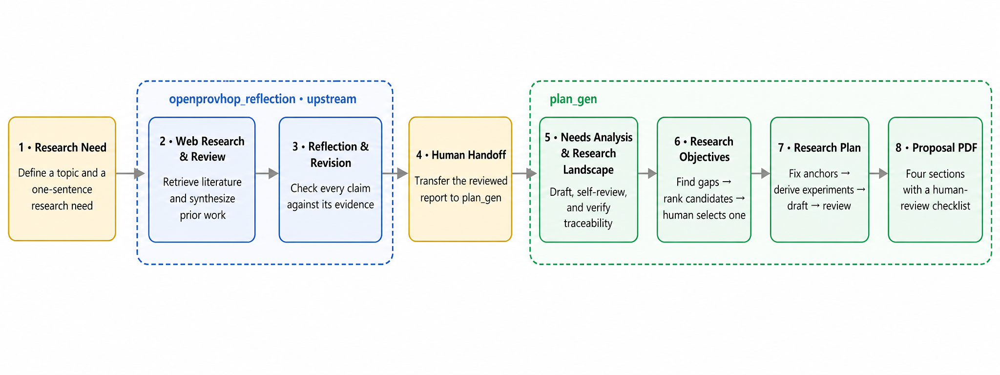

# Education Case Study

This example demonstrates how plan_gen transforms an evidence-grounded
literature review into a complete research proposal for AI-enabled
personalized learning in low-resource educational settings.

## Pipeline

## Included files

- `openprovhop-review.txt`: reviewed literature report used as input
- `education-case-study.pdf`: end-to-end execution record
- `research-proposal-zh.pdf`: generated Chinese research proposal
- `research-proposal-en.pdf`: generated English translation
- `pipeline.png`: overview of the complete workflow

## Case summary

The reviewed evidence described limitations involving computational
requirements, demographic fairness, and privacy overhead. The system
generated multiple candidate research objectives, evaluated and ranked them,
and left the final selection to the researcher.

The selected objective was expanded into an experimental plan for
resource-efficient, fair, and privacy-preserving personalized learning. Three
switchable technical components produced eight factorial configurations.

## Language note

The Chinese proposal is the authoritative generated version. The English
proposal is a faithful translation produced after the Chinese draft was
finalized.
